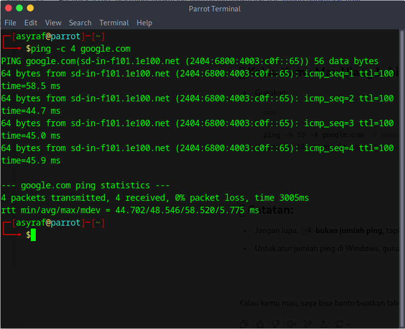

# 🧠 TryHackMe Write-Up: What is Networking

📚 **Path:** Pre-Security → Network Fundamentals  
📅 **Completed on:** 12 July 2025

---

## 🎯 Room Objective

This room introduces the foundational concepts of computer networking. It's designed for absolute beginners and covers key principles like:

- What an IP address is and how it's used  
- The difference between private and public IPs  
- Core network tools and how to use them  
- DNS, gateway, and subnet basics  
- An introduction to the OSI Model and network protocols

---

## 🧠 Summary of Key Concepts

| Topic               | Description |
|--------------------|-------------|
| **IP Address**      | A unique identifier assigned to each device on a network. |
| **Private vs Public IP** | Private IPs are used internally, while public IPs are accessible over the internet. |
| **DNS**             | Converts human-readable domain names into IP addresses. |
| **Gateway**         | A node that acts as a passage between different networks. |
| **Subnet**          | Helps divide a network into smaller, manageable sections. |
| **Basic Tools**     | `ping`, `ipconfig` / `ip a`, `nslookup`, `tracert` / `traceroute` |

---

## 🔧 Commands Practiced

| Command                | Purpose |
|------------------------|---------|
| `ip a` / `ipconfig`    | View IP configuration |
| `ping`                 | Test connectivity to another host |
| `traceroute` / `tracert` | Trace the route packets take to a destination |
| `nslookup`             | Query DNS records for a domain |

---

## 📸 Practice Screenshots

> Note: No challenge answers or sensitive information are shown in accordance with TryHackMe’s guidelines.

- `ip a` output  
  

- `ping google.com`  
  

- `nslookup facebook.com`  
  

- OSI Model sketch (optional)  
  

---

## 💬 Personal Reflection

> “This room opened my eyes to how networking works under the surface. I always thought the internet was just ‘magic,’ but now I understand the roles of IPs, DNS, and how packets move. Can’t wait to dive deeper into protocols and packet analysis.”

---

## 🔗 Links

- 🔐 [TryHackMe Room – What is Networking](https://tryhackme.com/room/whatisnetworking)  
- 📘 [My Full Write-Up (Notion)](https://www.notion.so/TryHackMe-What-Is-Networking-2301401825208007bb8edcb036fdcd9c?source=copy_link)  
- 📁 [Screenshots Folder](./screenshots)

---

> 💡 *This write-up follows TryHackMe’s ethical guidelines: no answer spoilers, only concept summaries and personal learning notes.*
